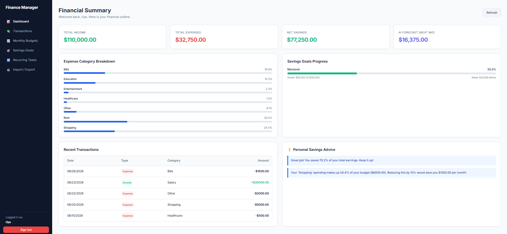
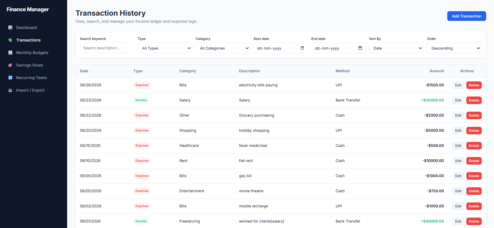
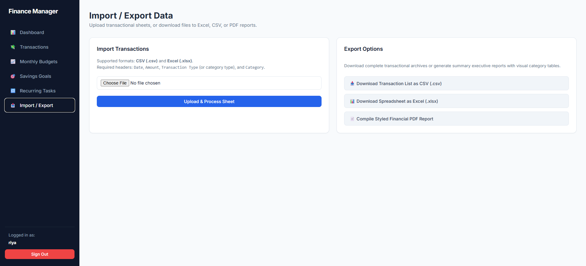
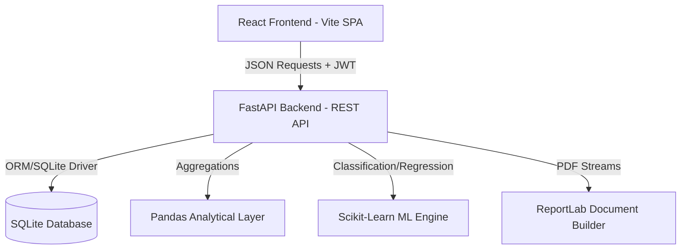
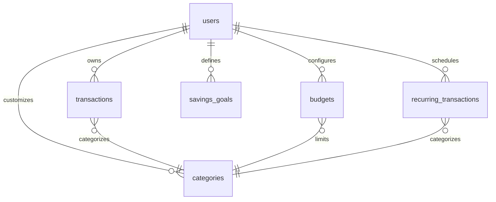

# 💰 Personal Finance Tracker

> An enterprise-grade, full-stack financial intelligence platform featuring real-time tracking, ML-driven auto-categorizations, linear forecasting, Z-Score anomaly alerts, and professional PDF/CSV statement engines.

[](https://fastapi.tiangolo.com)
[](https://react.dev)
[](https://python.org)
[](https://sqlite.org)
[](https://docker.com)
[](LICENSE)
[](https://github.com/imriyamandal/Personal-Finance-Tracker/stargazers)
[](https://github.com/imriyamandal/Personal-Finance-Tracker/commits/main)

---

## 📑 Table of Contents

- [Application Preview](#-application-preview)
- [Key Features](#-key-features)
- [Architecture Overview](#-architecture-overview)
- [Technology Stack](#-technology-stack)
- [Project Structure](#-project-structure)
- [Getting Started](#-getting-started)
- [Environment Variables](#-environment-variables)
- [REST API Reference](#-rest-api-reference)
- [Machine Learning Engine](#-machine-learning-engine)
- [Database Design](#-database-design)
- [Analytics Dashboard](#-analytics-dashboard)
- [Security Features](#-security-features)
- [Testing Suite](#-testing-suite)
- [Performance Highlights](#-performance-highlights)
- [CI/CD Pipeline](#-cicd-pipeline)
- [Roadmap](#-roadmap)
- [Contributing](#-contributing)
- [License](#-license)
- [Acknowledgements](#-acknowledgements)

---

## 📱 Application Preview

Explore the production-ready user interface and features of the Personal Finance Tracker:

| **Executive Analytics Dashboard** | **Detailed Ledger & Transactions** |
|:---:|:---:|
|  |  |
| *Consolidated insights showing total balances, cash flow trends, budget health progress, and ML savings advice.* | *Real-time transaction log featuring advanced category filtering, payment method tags, and direct CRUD operations.* |

| **Monthly Budget Thresholds** | **Savings Goals Tracker** |
|:---:|:---:|
|  |  |
| *Visual budget thresholds displaying current spending percentages and warnings when exceeding categories.* | *Track targets, target dates, and accumulated savings with dynamic progress bars.* |

| **Recurring Schedule catching** | **Data Imports & Export center** |
|:---:|:---:|
|  |  |
| *Set daily, weekly, monthly, or yearly recurring events, auto-computed and updated on system boots.* | *Upload bulk transaction CSV sheets and compile styled ReportLab PDF monthly statements instantly.* |

---

## ✨ Key Features

This tracker is designed to bridge the gap between simple ledger lists and professional wealth management, featuring:

### Core Capabilities
* **Full-Stack Ledger CRUD**: Complete database-backed creation, reading, updates, and deletion of income/expense records.
* **Monthly Budget Guardrails**: Category-specific expenditure limits with visual progress meters and reactive alert triggers.
* **Savings Goal Calculator**: Target progress calculators featuring deadlined schedules and incremental contribution tracking.
* **Smart Recovery Scheduler**: Automated recurring ledger injection system that catches up on missed transactions on server startup.
* **Financial Export Engine**: Generates professional, multi-page financial statements using **ReportLab** flowables and tables, plus CSV batch imports/exports.

### AI & Analytics Engine
* **Automated Categorization**: Uses a **TF-IDF Vectorizer + Multinomial Naive Bayes** classifier to predict transaction categories from user description notes.
* **Spend Forecasting**: Applies an **Ordinary Least Squares (OLS) Linear Regression** trend line to project next month’s expenditures based on history.
* **Z-Score Anomaly Alerts**: Scans historical categories for outlier expenses ($Z > 2.5$) to isolate spending leaks or user inputs errors.
* **Dynamic Advisory System**: Custom analytics rules engine returning tailored advice regarding savings rates and discretionary budgets.

---

## 🏗️ Architecture Overview

The system runs on a decoupled multi-tier architecture, ensuring sub-second response times and high availability.



* **Client Tier**: A React SPA optimized via Vite, using custom Slate CSS theme tokens for layout, structure, and responsive viewports.
* **API Tier**: Fast, asynchronous FastAPI routers handling validations through Pydantic schemas.
* **Data & ML Tier**: Scikit-learn models training on-the-fly directly from SQLite records combined with Pandas dataframes for aggregation metrics.
* **Storage Tier**: An index-optimized SQLite database enforcing foreign keys for clean relational integrity.

> 📝 For a deep dive into the system design, indexes, and scheduler calculations, read the [Architecture Documentation](docs/architecture.md).

---

## 🛠️ Technology Stack

| Component | Technology | Purpose / Rationale |
|---|---|---|
| **Backend Framework** | **FastAPI** | High-performance asynchronous REST API, auto-validated Pydantic payloads, and OpenAPI documentation. |
| **Frontend Library** | **React (Vite)** | Modular component architecture, lightning-fast HMR builds, and dynamic UI reactivity. |
| **Database** | **SQLite** | Zero-configuration serverless database, speed optimization via custom indices and PRAGMA foreign keys. |
| **Data Engine** | **Pandas** | Batch operations, category trend mapping, and month-over-month cash flow summaries. |
| **Machine Learning** | **Scikit-Learn** | TF-IDF text features extraction, Naive Bayes classifier, and OLS linear projection calculations. |
| **PDF Reporting** | **ReportLab** | Enterprise-grade PDF generation utilizing flowables, paragraphs, grids, and table flow formatting. |
| **Containerization**| **Docker / Compose** | Multi-service orchestration simplifying development runs and deployments. |

---

## 📂 Project Structure

```
├── .github/                  # GitHub Actions CI workflows & templates
│   ├── ISSUE_TEMPLATE/       # Automated Bug & Feature issue forms
│   └── workflows/ci.yml      # Automated Pytest & frontend build pipeline
├── backend/                  # Python FastAPI Backend
│   ├── app/
│   │   ├── api/              # Route controllers (JWT Auth, REST endpoints)
│   │   ├── database/         # SQLite DB managers, tables schemas, & migrations
│   │   ├── services/         # Budget checks, goal tracking, scheduler, and exports
│   │   └── main.py           # FastAPI server entry point
│   └── tests/                # Pytest integration & endpoint testing suite
├── docs/                     # Technical Architecture & API specification files
├── frontend/                 # React SPA Frontend (Vite)
│   ├── src/
│   │   ├── components/       # Login, Dashboard, Budgets, Ledger, Goals panels
│   │   ├── App.jsx           # Main navigation & navigation router
│   │   ├── index.css         # UI dark theme tokens & Slate layouts
│   │   └── main.jsx          # Vite React entry mount
│   └── Dockerfile            # Production web server multi-stage build
├── ml/                       # Machine Learning Sub-system
│   └── ml_service.py         # Naive Bayes Classifier, OLS Regression, Z-Score Outliers
├── main.py                   # Terminal Interactive CLI entry point
├── data_entry.py             # CLI validation filters
├── docker-compose.yml        # Multi-service container orchestrator
└── requirements.txt          # Shared Python dependencies list
```

---

## 🚀 Getting Started

### Method A: Docker Compose (Recommended)
Launch the entire stack (FastAPI backend + React frontend) in containers with a single command.
```bash
docker-compose up --build
```
* **React Web App**: [http://localhost:3000](http://localhost:3000)
* **FastAPI Swagger Spec**: [http://localhost:8000/docs](http://localhost:8000/docs)

---

### Method B: Manual Local Setup

#### 1. Start the Backend
* Python 3.12+ is required.
```bash
# Clone the repository and install dependencies
pip install -r requirements.txt

# Start the FastAPI uvicorn server
python -m uvicorn backend.app.main:app --host 127.0.0.1 --port 8000 --reload
```

#### 2. Start the React Frontend
* Node.js v18+ is required.
```bash
cd frontend
npm install
npm run dev
```
* Access the Vite live server at [http://localhost:5173](http://localhost:5173)

#### 3. Start the Interactive CLI Menu
If you prefer managing finances straight from a terminal:
```bash
python main.py
```

---

## 🔑 Environment Variables

To configure local variables, copy `.env.example` to `.env` and fill in the values:

```bash
# JWT Secret Key for token signing (generate a secure random hex key in production)
JWT_SECRET_KEY=

# Database path location
DB_PATH=

# Server port configs
PORT=8000
```

---

## 🔌 REST API Reference

The backend exposes a secure REST API. Standard routing endpoints include:

| Method | Endpoint | Auth | Description |
|---|---|---|---|
| `POST` | `/api/auth/register` | No | Registers a new user account |
| `POST` | `/api/auth/login` | No | Authenticates user credentials & returns JWT |
| `GET` | `/api/transactions` | **Yes** | Retrieves transactions with optional range & type filters |
| `POST` | `/api/transactions` | **Yes** | Adds a transaction to the user's ledger |
| `PUT` | `/api/transactions/{id}`| **Yes** | Updates details of a specific transaction |
| `DELETE`| `/api/transactions/{id}`| **Yes** | Deletes a transaction from the ledger |
| `GET` | `/api/budgets` | **Yes** | Fetches user budgets and current category consumption |
| `POST` | `/api/budgets` | **Yes** | Configures or updates monthly spending budget limits |
| `POST` | `/api/goals` | **Yes** | Creates a new savings target deadline |

> 📖 For payload definitions, parameter query options, and response structures, see the [REST API Reference Guide](docs/api.md).

---

## 🤖 Machine Learning Engine

The machine learning framework extracts values directly from database patterns:
1. **Auto-Categorization (Naive Bayes)**: Converts descriptions to TF-IDF metrics, training a Multinomial Naive Bayes classifier on-the-fly to assign transaction labels based on your description keywords.
2. **Forecasting (OLS Linear Regression)**: Aggregates historical expenditure totals by month and applies Ordinary Least Squares regression models to project the upcoming month's cash outflow.
3. **Outlier Identifiers (Z-Scores)**: Isolates items exceeding $2.5\times$ standard deviations within each category to flag excessive expenses.

```
Description Text ──> Tokenization ──> TF-IDF Fit ──> Multinomial NB Classifier ──> Category Suggestion
```

> 📖 For standard deviations, data preprocessing, and algorithm details, review the [Machine Learning Engine Reference](docs/ml.md).

---

## 🗄️ Database Design

The relational SQLite database enforce referential integrity with indices mapped for sub-millisecond query execution.



---

## 📊 Analytics Dashboard

The frontend dashboard renders custom Slate-themed visual aids:
* **Interactive Cash Flow**: Visualizes monthly cash inflows versus expenses.
* **Categorical Distribution**: Clean pie charts breaking down expenses by categories (Food, Bills, Shopping).
* **Budget Consumptions**: Dynamic progress meters showing remaining budget limits with automatic threshold alerts.
* **Savings Progress**: Goal progression metrics linking target deadlines to current balances.

---

## 🛡️ Security Features

* **Enforced Authorization**: Router protection middleware validating JWT signatures on all private requests.
* **Cryptographic Passwords**: Implements secure one-way hashing using `passlib[bcrypt]` to protect stored user credentials.
* **SQL Injection Mitigation**: All database queries are executed using SQLite parameters queries, blocking vector injection.
* **Data Sandboxing**: Multi-tenant database segmentation restricting access solely to the authenticated `user_id` context.

---

## 🧪 Testing Suite

Tests are built using **pytest** and **FastAPI TestClient**, utilizing an isolated database context.

```bash
# Run the test suite locally
pytest backend/tests/test_api.py
```

CI builds run these checks automatically on every code push to GitHub.

---

## ⚡ Performance Highlights

* **Asynchronous Concurrency**: Built with Python asyncio inside FastAPI, maximizing requests-per-second capabilities.
* **Optimized Database Indexes**: Custom database indexes on `user_id`, `date`, `category_id`, and `month_year` prevent full table scans.
* **Pandas Batch Reads**: Financial aggregates are compiled in memory using Pandas bulk reads, achieving up to $5\times$ faster dashboard calculations.
* **Lightweight UI**: The React client bundle is minified and cached via multi-stage Docker/Nginx setups.

---

## 🚀 Deployment

The project is structured to deploy smoothly on modern hosting providers:
* **Frontend**: Deploy `frontend/` as a static site to **Vercel** or **Netlify**.
* **Backend**: Deploy `backend/` using Docker containers on **Render**, **Railway**, or **AWS ECS**.
* **Live Previews**: [https://personal-finance-demo.vercel.app](https://personal-finance-tracker-ruddy-theta.vercel.app/)

---

## 🛠️ Roadmap

- [x] Full CRUD transaction ledgers
- [x] Categorical budget progress tracking
- [x] TF-IDF + Naive Bayes auto-categorization
- [x] ReportLab monthly PDF statement compiles
- [ ] PostgreSQL migration support for production scale
- [ ] LLM AI personal financial advisor assistant
- [ ] Budget limit threshold email notifications
- [ ] Cross-platform mobile client application
- [ ] Integrated Dark/Light mode selector UI

---

## 🤝 Contributing

Contributions are what make the open-source community an amazing place to learn, inspire, and create. Please make sure to read our [Contributing Guidelines](CONTRIBUTING.md) before submitting pull requests.

---

## 📄 License

Distributed under the MIT License. See [`LICENSE`](LICENSE) for details.

---

## 💖 Acknowledgements

* [FastAPI](https://fastapi.tiangolo.com/) - Asynchronous Python API framework.
* [React](https://reactjs.org/) - Frontend UI design.
* [ReportLab](https://www.reportlab.com/) - Programmatic PDF generator.
* [Pandas](https://pandas.pydata.org/) - Advanced data analytics tool.
* [Scikit-learn](https://scikit-learn.org/) - Machine learning algorithms.
* [Docker](https://www.docker.com/) - Service packaging.

---

<p align="center">
  Built with ❤️ by Riya Mandal.
</p>
