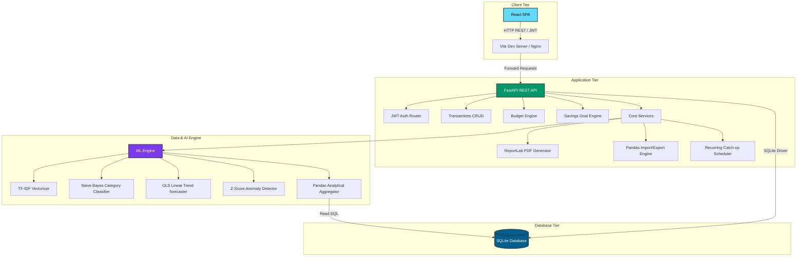

# Architecture Overview

This document provides a detailed breakdown of the technical architecture of the **Personal Finance Tracker** application, explaining the structural and performance decisions that make this a robust, high-performance, and scale-ready portfolio system.

---

## High-Level System Architecture

The application is structured as a decoupled multi-tier web application, featuring a lightweight React Single Page Application (SPA) on the frontend, a fast asynchronous FastAPI REST service on the backend, an embedded SQLite database engine, and a Python Machine Learning (ML) sub-system.

---

## 💻 Frontend Architecture (React SPA)

The frontend is a modern web application built using **Vite + React**. 
* **State Management**: React's component state controls views, navigation (Sidebar controller), and current authentication states.
* **Styling**: Utilizes a customized dark Slate CSS stylesheet built using custom CSS tokens and media queries for complete responsiveness.
* **Component Breakdown**:
  * `Auth.jsx`: Login/Registration interface, manages access tokens in local storage.
  * `Dashboard.jsx`: Executive summary view rendering financial ratios, ML alerts, OLS projections, and interactive charts (savings progress, monthly trends).
  * `Transactions.jsx`: CRUD interface for transaction ledgers with category filters and pagination.
  * `Budgets.jsx`: Budget setup and tracking panel, displaying progress bars with dynamic threshold warning alerts.
  * `Goals.jsx`: Savings goal calculator and target progression indicators.
  * `Imports.jsx`: CSV/Excel upload handlers and ReportLab PDF report compilation downloads.

---

## ⚙️ Backend Architecture (FastAPI REST API)

The backend is built with **FastAPI**, choosing high concurrency, automated schema validation (via Pydantic), and built-in interactive Swagger documentation.

* **API Routers**: Segmented into modular paths:
  * `/api/auth/*`: Registration, login, JWT issuance, and verification.
  * `/api/transactions/*`: Full CRUD transactions tracking with filters (date range, type, category).
  * `/api/budgets/*`: Budget parameters definition and monthly tracking.
  * `/api/goals/*`: Goal additions and savings status updates.
  * `/api/recurring/*`: Manage templates for automated future transaction tracking.
  * `/api/dashboard/*`: Master aggregator endpoint pulling financial metrics, charts, and ML insights.

---

## ⏰ Scheduler Recovery Mechanism

To automate recurring transactions (e.g. monthly subscriptions, rent, salary) without running resource-heavy background processes constantly, the system implements an **On-Boot Catch-up Scheduler**:
1. When the server starts up or the CLI boots, the `scheduler.catch_up_recurring()` service is initialized.
2. The database is queried for active recurring transaction templates where `next_occurrence <= today`.
3. For each overdue item:
   * The scheduler calculates the exact number of occurrences that occurred between `next_occurrence` and the current date (based on the defined frequency: `daily`, `weekly`, `monthly`, `yearly`).
   * It inserts new transactions into the ledger for each occurrence.
   * It updates the template's `next_occurrence` to the future date.
4. This ensures that even if the server is offline or restarting, no transactions are missed, and calculations are kept accurate upon service restoration.

---

## 🗄️ Database Design & Optimization

An embedded SQLite database is used for fast access times, requiring zero operational setup overhead. To ensure database speed under heavy data loads, the following architectural choices were made:

### Schema Design & Constraints
* **Enforced Foreign Keys**: To guarantee database referential integrity, the SQLite connection is configured with `PRAGMA foreign_keys = ON;` upon initialization. Cascading deletes (`ON DELETE CASCADE`) are set on all child tables to prevent orphaned data records.
* **Data Typings**: Date formats are strictly stored as ISO strings (`YYYY-MM-DD` and `YYYY-MM`) allowing lexicographical sorting and range queries.

### Performance Indexing Strategy
To optimize query performance, index paths were created on key columns:
1. `idx_transactions_user_date` (`user_id`, `date`): Speeds up ledger loading and date range filtering.
2. `idx_transactions_category` (`category_id`): Speeds up categorical sum aggregates for budgeting.
3. `idx_budgets_user_month` (`user_id`, `month_year`): Optimizes retrieval of budgets for current months.
4. `idx_goals_user` (`user_id`): Speeds up saving goals loading.

---

## 📊 Analytics & Reporting Engine

The financial analytics engine sits alongside the database to aggregate data points and render visual analytics:
* **Pandas Analytics Layer**: Aggregates records to produce analytical details (e.g. debt-to-savings ratios, average daily expenditures, month-over-month variances).
* **ReportLab PDF Compiler**: Creates styled multi-page PDF statements using ReportLab flowables, tables, paragraph styles, and page layouts, running as a stream directly back to the client.
