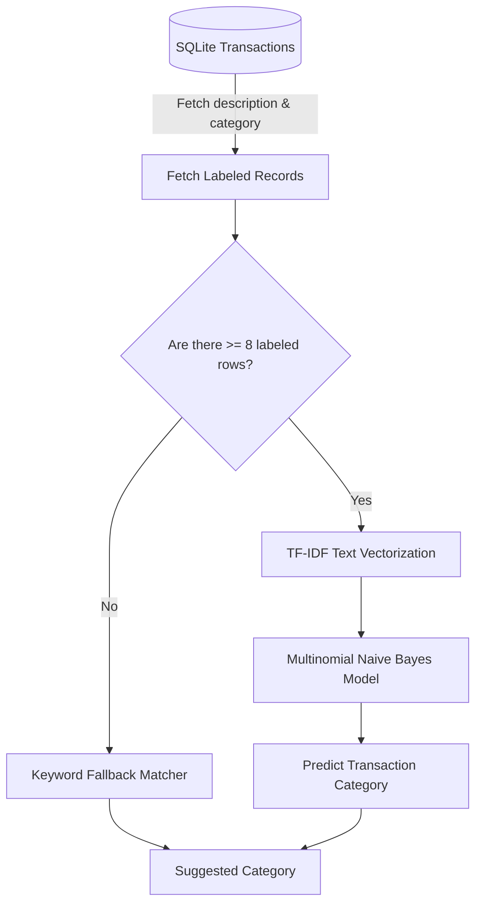

# Machine Learning Engine

The **Personal Finance Tracker** features an integrated, light-weight machine learning backend built using **Scikit-learn**, **Pandas**, and **Numpy**. This document details the algorithmic logic, mathematical frameworks, and fallback heuristics powering the system.

---

## 🛠️ ML Service Architecture & Data Flow

The ML engine runs in-process alongside the FastAPI application. Instead of maintaining external heavy model endpoints, the service trains lightweight models on-the-fly using the user's local SQLite database.

---

## 1. 🏷️ Transaction Auto-Categorization

When a user records or imports transactions with vague description strings (e.g., "starbucks", "uber ride"), the application predicts the appropriate category.

### The Algorithm: TF-IDF + Multinomial Naive Bayes
1. **Preprocessing & Tokenization**: Transaction descriptions are converted to lowercase and tokenized using an alphanumeric regular expression pattern `(?u)\b\w+\b`.
2. **Feature Extraction (TF-IDF)**: Words are transformed into numerical values using Term Frequency-Inverse Document Frequency (TF-IDF):
   $$\text{TF-IDF}(t, d, D) = \text{TF}(t, d) \times \text{IDF}(t, D)$$
   This highlights rare, descriptive keywords (like "uber") while discounting common generic terms.
3. **Classification (Multinomial NB)**: A Multinomial Naive Bayes classifier calculates the probability of each category $C$ given the feature vector $X$:
   $$P(C \mid X) \propto P(C) \prod_{i=1}^{n} P(x_i \mid C)$$
   The category with the highest posterior probability is returned as the predicted label.

### Heuristic Fallback System
Training a classifier requires sufficient data.
* **Condition**: If the user's database contains **fewer than 8 transactions** with descriptions, ML training is skipped.
* **Mechanism**: The engine falls back to a regex-based keyword dictionary (`FALLBACK_MAPPINGS`) search (e.g. matching "rent" $\to$ Rent, "gig" $\to$ Freelancing, "groceries" $\to$ Food). If no keyword matches, it falls back to a default value (`Other` or `Other Income`).

---

## 2. 📉 Spending Forecast

To warn users of high future expenses, the system predicts overall spending for the upcoming month.

### The Algorithm: Ordinary Least Squares (OLS) Linear Regression
1. The engine aggregates historical transactions into monthly intervals:
   $$y = [S_1, S_2, \dots, S_n]$$
   where $S_i$ represents the total expense amount in month $i$.
2. It constructs a simple temporal index feature matrix:
   $$X = [0, 1, \dots, n-1]^T$$
3. An OLS Linear Regression model fits a linear trend line:
   $$y = mX + c$$
   by minimizing the sum of squared residuals:
   $$\text{RSS} = \sum_{i=1}^{n} (y_i - (mX_i + c))^2$$
4. To forecast next month's total spending, it computes:
   $$\hat{y}_{n} = m(n) + c$$
   The prediction is bounded at $0.0$ to prevent negative forecasts.

### Fallback System
* **Condition**: If the user has **fewer than 3 months** of transaction history, a linear trend line cannot be calculated.
* **Mechanism**: The system falls back to calculating the simple arithmetic mean of all historical monthly expenses.

---

## 🚨 3. Outlier / Anomaly Detection

Unusual or excessive single expenses are flagged automatically to alert the user of potential budget leaks.

### The Algorithm: Z-Score Statistics
1. The engine separates transactions by category.
2. For each category, it requires a baseline of **at least 5 transactions** to establish stable metrics.
3. It computes the category mean ($\mu$) and standard deviation ($\sigma$):
   $$\mu = \frac{1}{N}\sum_{i=1}^{N} x_i$$
   $$\sigma = \sqrt{\frac{1}{N}\sum_{i=1}^{N} (x_i - \mu)^2}$$
4. For each transaction amount $x$ in that category, the Z-Score is calculated:
   $$Z = \frac{x - \mu}{\sigma}$$
5. If **$Z > 2.5$**, the transaction is classified as an **anomaly outlier** (representing a value exceeding the 99.3rd percentile of historical patterns in that category) and returned as an alert on the dashboard.

---

## 💡 4. Personalized Insights Engine

The rules engine combines numerical ratios with ML forecasts to generate customized advice:
1. **Savings Rate Metric**:
   $$\text{Savings Rate} = \frac{\text{Income} - \text{Expenses}}{\text{Income}} \times 100$$
   * If savings rate is **$< 15\%$**, it prompts the user to automate savings to reach the recommended $15-20\%$ baseline.
2. **Discretionary Spending Flags**:
   * Evaluates discretionary categories: `Food`, `Shopping`, `Entertainment`.
   * If any discretionary category accounts for **$> 20\%$** of total spending, it highlights the potential savings (in dollars) of reducing that specific category by $15\%$.
3. **Forecast Volatility Alert**:
   * If the OLS predicted spending for the upcoming month exceeds the current month's spending by **$> 10\%$**, the user receives a warning alert recommending stricter budget thresholds.
